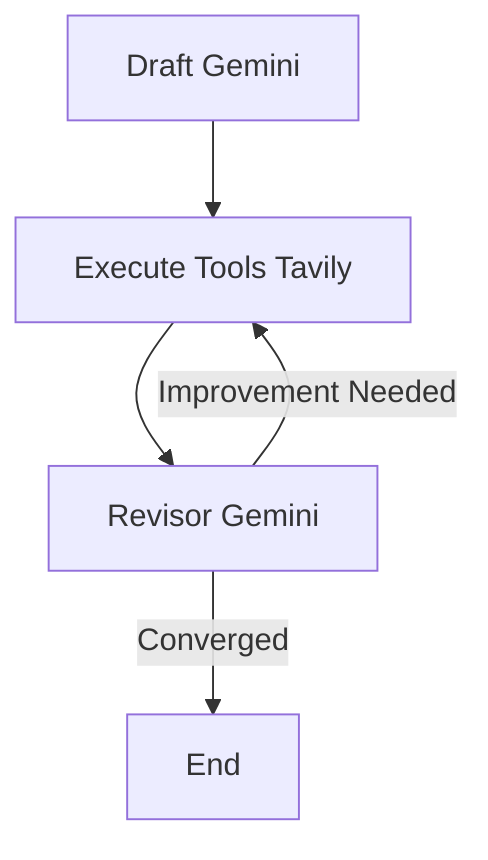

# 🧠 Neural Reflexion Agent

**Self-Improving AI Reasoning with LangGraph, Gemini, Tavily & Streamlit**

## 🚀 Overview

The Neural Reflexion Agent simulates human-like reasoning, critique, and self-improvement. It uses LangGraph to model a feedback-driven cognitive loop where an LLM (Gemini) drafts, reflects, retrieves evidence, and revises its own answers using real-time web data (Tavily).

The Streamlit UI lets you interactively explore each reasoning cycle, view citations, compare runs, and export results.

## 🧩 Key Features

- ✅ **LangGraph Reflexion Loop** — iterative reasoning chain: draft → execute_tools → revisor
- ✅ **Self-Critique & Revision** — each iteration improves clarity, evidence, and structure
- ✅ **Live Web Search** — integrates the Tavily API for real-time data grounding
- ✅ **Heuristic Reward Scoring** — mimics RL convergence with a self-evaluation score
- ✅ **Streamlit UI** — intuitive front-end for prompts, iterations, results, and comparisons
- ✅ **Downloadable Outputs** — export final answer (Markdown) or full reasoning trace (JSON)

## 🧠 System Architecture



1. **Draft** → Generates initial answer & self-reflection
2. **Execute Tools** → Runs Tavily search for suggested queries
3. **Revisor** → Refines answer using new evidence and adds citations
4. **Loop Control** → Stops automatically when reward score stabilizes

## 🧮 Reward-Driven Reflexion

Each revision is evaluated with a heuristic reward function that scores:

- Conciseness (~250 words target)
- Number of valid references
- Inline citations ([1], [2])
- Query coverage
- Iterative improvement

When the reward stops increasing → the loop ends.

This creates a reinforcement-inspired reasoning process — language-based self-improvement without gradient updates.

## 🔁 Relation to Reinforcement Learning

This project doesn't perform gradient-based RL (no Q-learning or PPO). However, it borrows the conceptual structure of reinforcement learning:

| RL Concept | Reflexion Equivalent |
|------------|---------------------|
| Environment | LangGraph + Tavily + LLM |
| State | Conversation + evidence context |
| Action | Revised answer |
| Reward | Heuristic self-evaluation score |
| Policy Update | Prompt-level behavior change via self-reflection |

This approach, often called **language-based self-reinforcement**, shows how LLMs can simulate RL-like learning through reflection and scoring rather than model fine-tuning.

## 🧰 Project Structure

```
neural-reflexion-agent/
├── chains.py              # Defines Gemini prompt chains (draft & revisor)
├── execute_tools.py        # Tavily search tool executor
├── reflexion_agent.py      # Core LangGraph pipeline + scoring logic
├── schema.py               # Pydantic tool models
├── ui_app.py               # Streamlit interface
├── requirements.txt        # Dependencies
└── .env                    # API keys (not committed)
```

## 💻 Streamlit UI

Run:

```bash
streamlit run ui_app.py
```

### UI Highlights:

- 🧠 Prompt box + "Run Reflexion" button
- ⚙️ Sidebar controls (max iterations, environment key checks)
- 🔁 Live run status
- 📄 Final answer with citations
- 🌐 Deduplicated sources from Tavily
- 📊 Run history + side-by-side comparison
- 💾 Export to Markdown or JSON

## 📦 Installation

### 1️⃣ Install dependencies

```bash
pip install -r requirements.txt
```

### 2️⃣ Add your API keys in `.env`

```env
GOOGLE_API_KEY=your_gemini_key_here
TAVILY_API_KEY=your_tavily_key_here
```

### 3️⃣ Run the agent in CLI mode

```bash
python reflexion_agent.py
```

### 4️⃣ Launch the Streamlit UI

```bash
streamlit run ui_app.py
```

Then open `http://localhost:8501`.

## 📘 Example Output

**Prompt:**

> Write about how small business can leverage AI to grow.

**Final Answer:**

> Small businesses can strategically leverage artificial intelligence (AI) to accelerate growth without significant investment. In marketing, platforms like Mailchimp use AI to optimize email subject lines, improving open rates [1]. Chatbots such as Tidio can automate up to 87% of routine queries, cutting costs [2].
>
> Operationally, AI tools like QuickBooks automate invoicing and expense tracking, reducing administrative overhead by 29% [3]. Small businesses should start with affordable, scalable tools requiring minimal technical expertise.
>
> Ethical adoption is crucial: companies must ensure transparency and compliance with GDPR and CCPA [4]. By focusing on specific, measurable areas and responsible practices, small businesses can use AI as a sustainable growth engine.

**References:**

- [1] Mailchimp Subject Line Helper
- [2] Tidio Chatbot Statistics
- [3] McKinsey: State of AI 2023
- [4] Forbes Tech Council: AI & Data Privacy

## ⚙️ Dependencies

```
langchain>=0.2.16
langgraph>=0.2.27
langchain-google-genai>=2.0.4
langchain-tavily>=0.1.0
tavily-python>=0.5.0
pydantic>=2.7.0
python-dotenv
google-generativeai
google-ai-generativelanguage
streamlit
```

## 🧩 Future Extensions

| Feature | Description |
|---------|-------------|
| 🧠 Persistent Memory | Store learned reflections and source history across sessions |
| 📊 Reward Visualization | Track reward scores across iterations |
| 💬 Interactive Chat Mode | Let users refine prompts conversationally |
| 🧾 Q-Learning Extension | Apply numeric rewards and gradient-free policy updates |
| 🌐 Multi-Agent Reflexion | Cooperative agents that review each other's work |

## 🎓 Educational Value

This project bridges:

- **Cognitive Science** (self-reflection)
- **Reinforcement Learning Theory**
- **Retrieval-Augmented Generation**
- **LLM-Orchestrated Reasoning Graphs**

It's an ideal foundation for research or a showcase of AI self-improvement mechanisms — combining LangGraph, Google Gemini, and Tavily into a single, interpretable reasoning framework.

## 🧾 License

MIT License © 2025

You are free to modify and distribute this project with attribution.


