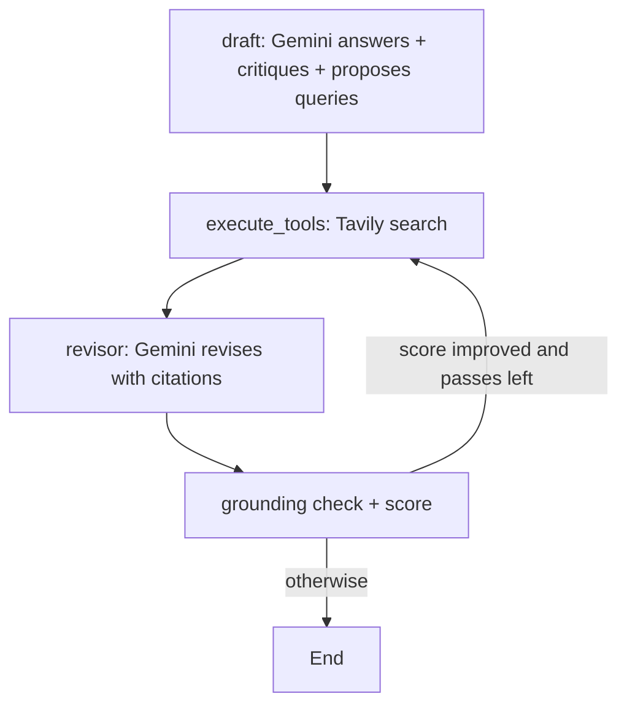

# Neural Reflexion Agent

[](https://github.com/LasyaRamachandruni/Neural-Reflexion-Agent/actions/workflows/ci.yml)

A Reflexion-style answer loop built with LangGraph: Gemini drafts an answer and critiques it, Tavily searches the web for the queries the critique suggests, and Gemini revises the answer with citations. Citations are then checked in code against the URLs that were actually retrieved. There is a command-line entry point and a Streamlit UI.

## How it works


```mermaid
graph TD
    A[draft: Gemini answers + critiques + proposes queries] --> B[execute_tools: Tavily search]
    B --> C[revisor: Gemini revises with citations]
    C --> G[grounding check + score]
    G -->|score improved and passes left| B
    G -->|otherwise| D[End]
```

1. **draft** (`chains.py`): Gemini returns an `AnswerQuestion` tool call with an answer, a reflection, and 1-3 search queries.
2. **execute_tools** (`execute_tools.py`): each query goes to `langchain_tavily.TavilySearch`. Its response (a dict with a `results` list, or an error) is normalized to `[{title, url, content}]` (top 3 per query). Failed queries are recorded as `{"error": ...}` rather than silently dropped.
3. **revisor** (`chains.py`, `reflexion_agent.py`): Gemini returns a `ReviseAnswer` with inline `[n]` citations and references written as `[n] Title - URL`, and is told to cite only URLs from the search results.
4. **Grounding check** (`grounding.py`): a deterministic post-check on every revision. A reference is kept only if its URL was returned by Tavily in this run. Other references are dropped, the rest are renumbered, inline `[n]` markers are fixed or removed to match, and raw URLs in the answer that were never retrieved are removed. Everything removed is reported.
5. **Stop condition** (`scoring.py`): each grounded revision gets a heuristic score (see below). The loop stops when a revision doesn't beat the best score so far, when the model proposes no more queries, or after `--max-iterations` search passes (default 2). The answer returned is the highest-scoring revision.

### The score

The score is a fixed checklist, not a learned reward and not reinforcement learning. It is only used to decide when to stop:

| Part | Points |
|------|--------|
| Length close to ~250 words | up to 30 |
| Grounded references (5 each) | up to 20 |
| Inline `[n]` markers that point at a grounded reference (4 each) | up to 20 |
| Search queries in the latest pass that returned results (10 each, max 3) | up to 30 |

Failed searches and citations that didn't survive the grounding check earn nothing.

## Project structure

```
chains.py          Prompts and the draft/revise chains (model passed in, Gemini by default)
execute_tools.py   Tavily search node and response normalization
grounding.py       Citation check against retrieved URLs
scoring.py         Heuristic score used for the stop condition
reflexion_agent.py Graph construction, final result, CLI
schema.py          Pydantic tool schemas (AnswerQuestion, ReviseAnswer)
ui_app.py          Streamlit UI
tests/             pytest suite with a fake LLM and a fake Tavily client
```

## Setup

Requires Python 3.10+.

```bash
python -m venv .venv
source .venv/bin/activate        # Windows: .venv\Scripts\activate
pip install -r requirements.txt
cp .env.example .env
```

Fill in `.env`:

```env
GEMINI_API_KEY=your_gemini_key      # GOOGLE_API_KEY also works
TAVILY_API_KEY=your_tavily_key
# GEMINI_MODEL=gemini-2.5-flash      # optional, default is gemini-2.5-pro
```

Get a Gemini key from Google AI Studio and a Tavily key from tavily.com.

## Usage

Command line:

```bash
python reflexion_agent.py "How can small businesses use AI to grow?" --max-iterations 2
```

It prints the final answer, its references, the score, how many searches returned results (and the error for any that failed), and any citations that were removed by the grounding check. `--show-graph` prints the graph as Mermaid instead.

Streamlit UI:

```bash
streamlit run ui_app.py
```

Then open http://localhost:8501. The UI shows the answer and references, the score, the search queries (with failures marked), the sources Tavily returned, any removed citations, a history of runs with side-by-side comparison, and Markdown/JSON export.

## Tests

```bash
pip install -r requirements-dev.txt
pytest
```

The tests use a fake Tavily client that returns the same dict shape as `TavilySearch` and a scripted fake chat model, so they need no API keys or network. They cover search response normalization, error handling, the grounding check, scoring of failed searches, a full graph run to a final answer, no state leaking between runs, and the Streamlit app. CI runs them on every push and pull request.

## Limitations

- The grounding check verifies that a cited URL was retrieved, not that the page supports the sentence citing it. The model can still misread or overstate a source.
- Tavily snippets are short (truncated to 600 characters here); the model never reads the full pages.
- The score is a hand-written heuristic. A higher score means more grounded citations and successful searches at roughly the target length, not a more correct answer.
- Each run makes several Gemini calls; with `gemini-2.5-pro` that can be slow and costs quota. `GEMINI_MODEL=gemini-2.5-flash` is cheaper.
- Uses LangGraph's `MessageGraph`, which is deprecated in LangGraph 1.0, so dependencies are pinned below 1.0.
- No memory between runs; every prompt starts fresh.

## License

Copyright (c) 2026 Lasya Ramachandruni. All rights reserved. See [LICENSE](LICENSE).
